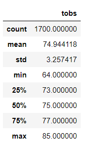
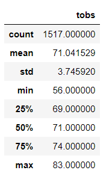

# Surfs_Up
Exploring weather data through the utilization of SQLite, SQLAlchemy,  and Flask

# Overview 
An analysis on the weather data in Oahu was completed to determine temperature levels in June and December of a given year. 

## Results

The results of the analysis demonstrated three key differences in the weather in June vs December. 

-	The maximum temperature for June (85 ℉) and December (83 ℉) was only a difference of 2 degrees 
-	The mean temperature in June (74 ℉) was only slightly warmer than the temperature in December (71 ℉)
-	The minimum temperature for June (64°F) was eight degrees more than December (56 ℉).

### June Tempatures                       December Tempatures
  

## Summary 
There was a difference of 183 data points in the data analyzed for June and December. This could potentially have a negative impact on the outcome of the analysis. Two additional queries that could be performed for June and December would be the amount of precipitation received in June and December to gain a better understanding of the likelihood of rain during those months and query the measurement table to determine the temperatures of each station during the months of June and December. 
